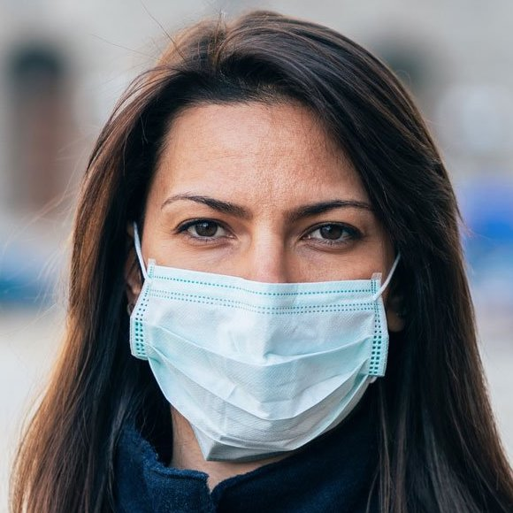
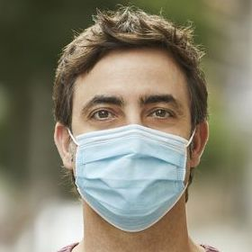
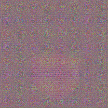
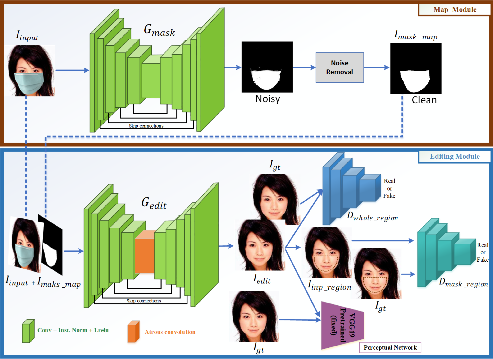

# :mask: Face-Mask Inpainting :kissing:

| | |
|:-------------------------:|:-------------------------:|
| |  |
| |  |


This project attempted to achieve the paper **[A novel GAN-based network for unmasking of 
masked face](https://ieeexplore.ieee.org/stamp/stamp.jsp?tp=&arnumber=9019697)**. The model 
is designed to remove the face-mask from facial image and inpaint the left-behind region based 
on a novel GAN-network approach.

## Training Environment
- Google Cloud Platform 
- GPU (Nvidia Tesla T4) 
- Python 3.8

## Models Architecture


Rather than using the traditional pix2pix U-Net method, in this work the model consists of two main modules, 
**map module** and **editing module**.In the first module, we detect the face-mask object and generate a 
binary segmentation map for data augmentation. In the second module, we train the modified U-Net 
with two discriminators using masked image and binary segmentation map.
### Data preparation
- For collecting the ground truth, we use **[Flickr-Faces-HQ Dataset (FFHQ)](https://github.com/NVlabs/ffhq-dataset)**.
- For creating the masked images, we use **[MaskTheFace](https://github.com/aqeelanwar/MaskTheFace)** to masking the ground truth. 

## Get Started
It is recommended to make a **[new virtual environment](https://towardsdatascience.com/manage-your-python-virtual-environment-with-conda-a0d2934d5195)** with **Python 3.8** and install the dependencies. Following steps
can be taken to download and run the Face-mask inpainting streamlit webapp on local host
### Clone the repository
```
git clone https://github.com/daviddirethucus/Face-Mask_Inpainting.git
```
### Download the trained models
Since it is not permissable to push the model which is larger than 100MB on Github, so we provide a link to download our trained Facemask Inpainting models: **[Here](https://drive.google.com/drive/folders/1l-5ntQyPi4hy1oc_3BHHTNCY4w4nzfEk?usp=sharing)** \n
**The path of the trained models should be located at: **
```
/Face-Mask_Inpainting/models
```
### Install required packages
The provided requirements.txt file consists the essential packages to install. Use the following command
```
cd Face-Mask_Inpainting
```

## Related Project

## Paper References

## Code References